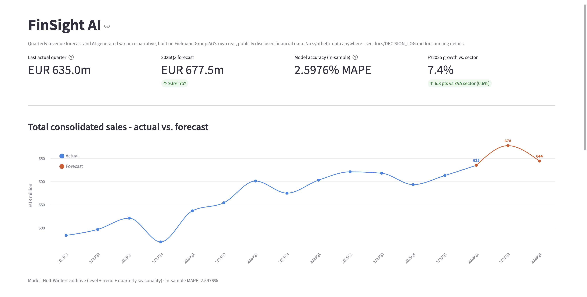
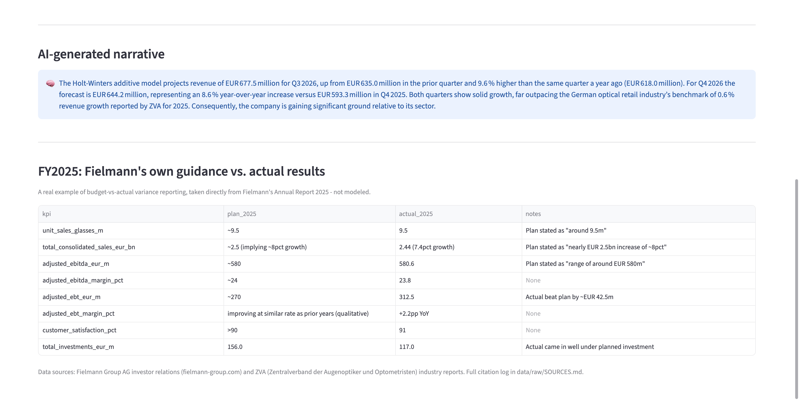

# FinSight AI

**Quarterly finance KPI forecasting + AI-generated variance narrative, built on Fielmann Group AG's own real, publicly disclosed financial data.**

Status: working end-to-end, live on GitHub.



## Table of contents

- [Why this project exists](#why-this-project-exists)
- [Why Fielmann's own data](#why-fielmanns-own-data)
- [What it does](#what-it-does)
- [Screenshots](#screenshots)
- [Architecture](#architecture)
- [Data](#data)
- [The forecasting model](#the-forecasting-model)
- [The AI narrative](#the-ai-narrative)
- [Key decisions](#key-decisions)
- [Things worth knowing before presenting this](#things-worth-knowing-before-presenting-this)
- [How to run](#how-to-run)
- [Repo layout](#repo-layout)
- [Cost](#cost)
- [Scope and limitations](#scope-and-limitations)

## Why this project exists

Built ahead of an interview for a **Data Scientist (AI & Automation)** role at Fielmann's Finance department. The job description asks for two specific things: forecasting/budgeting/scenario modeling, and using Generative AI to make finance processes more efficient. This project demonstrates both together, deliberately, as a fast and focused build rather than a multi-week one.

## Why Fielmann's own data

The original plan for this project was a synthetic finance dataset — fast to generate, no dependency on finding real data. That plan was deliberately abandoned. Fielmann Group AG is a public company (XETRA: FIE), so its own quarterly and annual financial disclosures are freely available. Forecasting the actual company the interview is for, using its own real numbers, is a substantially stronger demonstration than a generic synthetic dataset — and avoids the most common failure mode of portfolio projects, which is looking like every other Kaggle-dataset demo.

**No synthetic or fabricated data appears anywhere in this project.** Every figure is a real, cited number from a primary public source. Where more data density would have been useful, the fix was a second *real* data source (a German optical-retail industry benchmark), not synthetic padding — see [Key decisions](#key-decisions) for the reasoning behind that choice.

## What it does

1. Loads Fielmann Group's real quarterly total consolidated sales (Q1/2023-Q2/2026), derived from their own published interim statements and annual reports.
2. Forecasts the next two quarters with a Holt-Winters additive model (level + trend + quarterly seasonality), implemented directly with `numpy`/`scipy` so every step is inspectable rather than hidden in a library call. Current output: **2026Q3 at EUR 677.5m (+9.6% YoY)**, **2026Q4 at EUR 644.2m (+8.6% YoY)**, in-sample MAPE 2.6%.
3. Sends the forecast, its year-over-year growth, and the German optical retail sector's benchmark growth rate to a Groq-hosted model (`openai/gpt-oss-120b`), which writes a short executive-style narrative explaining the numbers.
4. Displays KPI stat tiles, an actual-vs-forecast chart, the AI narrative, Fielmann's own FY2025 Plan-vs-Actual guidance table (a real budget-vs-actual example, not modeled), and a sector-comparison metric, in a one-page Streamlit app. Falls back to showing the structured forecast data directly if Groq is unreachable.

## Screenshots

**Chart, KPI tiles, and AI narrative:**


**Plan-vs-actual table and sector benchmark:**



## Architecture

```
Fielmann quarterly revenue (real, cited)
  -> Holt-Winters forecast (numpy/scipy, src/forecast.py)
  -> forecast + YoY variance + sector benchmark -> structured prompt
  -> Groq API (openai/gpt-oss-120b, src/narrative.py) -> plain-language narrative
  -> Streamlit app (app.py): KPI tiles + chart (Altair) + narrative + plan-vs-actual + sector metric
```

Each stage is a plain, inspectable function — no orchestration framework, no hidden state. `src/forecast.py` and `src/narrative.py` both run standalone (`python src/forecast.py`, `python src/narrative.py`) so each piece can be checked in isolation.

## Data

All data is real, sourced from primary public disclosures, and fully cited with exact source URLs in [data/raw/SOURCES.md](data/raw/SOURCES.md):

| File | Contents |
|---|---|
| `data/processed/fielmann_annual_2021_2025.csv` | Group key figures, FY2021-FY2025 (revenue, EBITDA, EBT, net income, unit sales, stores, employees) |
| `data/processed/fielmann_quarterly_2023_2026.csv` | Group total consolidated sales by quarter, Q1/2023-Q2/2026, derived from cumulative Q1/H1/9M/FY disclosures |
| `data/processed/fielmann_plan_vs_actual_2025.csv` | Fielmann's own published guidance vs. actual results, FY2025 |
| `data/processed/fielmann_segment_2025.csv` | Revenue by region (Germany, Switzerland, Austria, Spain, North America, Other), FY2025 |
| `data/processed/zva_industry_benchmark_2021_2025.csv` | German optical retail industry revenue, store count, employment, 2021-2025 (ZVA, the German optical trade association) |

**Verification performed** (also logged in `data/raw/SOURCES.md`): the 2025 segment table's external sales figures sum exactly to Group total consolidated sales; the derived 2023 and 2024 quarterly figures sum exactly back to the audited annual totals. One known figure-level discrepancy (a 9M/2024 figure cited slightly differently across two reports, ~0.2% difference) is disclosed rather than silently resolved.

## The forecasting model

Holt-Winters additive exponential smoothing — level, trend, and a quarterly seasonal component — implemented from the update equations directly in `src/forecast.py`, not called from a forecasting library. Fitted by minimizing one-step-ahead squared error with `scipy.optimize`.

**Why this method, and why it changed mid-build:** the first version used Holt's linear trend (level + trend only), matching a "keep it simple" brief. Fitting it degenerated to a near-straight line — the optimizer pushed both smoothing weights to their lower bound, meaning it found no benefit to reacting to recent data over a fixed linear regression. That was a sign it was missing something. Looking at the data directly: Fielmann's Q4 revenue is lower than Q3 in **every single year** in the series (2023, 2024, 2025) — a real, consistent pattern (an eyewear/hearing-care retailer doesn't get the Q4 gift-retail bump a typical retailer would), not noise. Adding a seasonal component captured it: in-sample MAPE improved from 3.4% to 2.6%, and the forecast now correctly shows Q4/2026 below Q3/2026.

Current fitted parameters: alpha=0.99, beta=0.01, gamma=0.01 — the model leans almost entirely on the most recent quarter's level, with a very stable trend and seasonal estimate. Worth being able to explain if asked, since it's a specific, checkable claim about the model's behavior, not just a black-box output.

## The AI narrative

`src/narrative.py` calls Groq's OpenAI-compatible chat completions endpoint directly via `requests` (no SDK dependency). The prompt hands the model only structured numbers — the forecast, prior-year comparisons, and the sector benchmark — and instructs it to write like a finance analyst: short, specific about direction and magnitude, required to compare against the sector benchmark so the narrative explains *why* a number looks the way it does, not just what the number is. The model is configurable via a `GROQ_MODEL` environment variable rather than hardcoded, specifically because Groq's available models change over time (see [Key decisions](#key-decisions)).

## Key decisions

Full reasoning trail in [docs/DECISION_LOG.md](docs/DECISION_LOG.md) — eleven logged decisions, written as they were made rather than reconstructed afterward. Highlights:

- **Real data only, no synthetic padding.** Blending real, named-company data with invented numbers to fill gaps was considered and rejected: it's harder to defend under scrutiny than either being fully real or openly synthetic, especially for a finance audience that scrutinizes data provenance closely.
- **Quarterly, not monthly.** Fielmann doesn't publicly disclose monthly revenue (normal for a company at this reporting cadence), so the model works at the cadence the real data actually supports — which also matches how real corporate FP&A forecasting is actually done.
- **Holt-Winters, not a plain trend line.** See [The forecasting model](#the-forecasting-model) above.
- **ZVA over Destatis/handelsdaten.** ZVA (the German optical trade association) publishes a free, public annual industry report; Destatis's sector-level breakdown wasn't easily extractable, and handelsdaten.de's series is paywalled beyond a single data point.
- **Groq model swap.** The originally planned `llama-3.3-70b-versatile` returned a 404 against the real API key despite still appearing in Groq's docs. Rather than guess a replacement, queried Groq's `/models` endpoint directly with the real key to find what it actually had access to, and switched to `openai/gpt-oss-120b`.
- **Chart rebuild.** Streamlit's default `st.line_chart` produced garbled/truncated y-axis labels in practice. Replaced with an explicit Altair chart: fixed axis formatting, a legend, hover tooltips, and sparing direct end-labels only on the last actual point and the forecast points.

## Things worth knowing before presenting this

- The forecast is model output, not a certainty, and the sector comparison currently rests on one year (2025) of ZVA benchmark data. Worth saying so plainly rather than letting the chart imply more precision than it has.
- The fitted smoothing parameters (alpha=0.99, beta=0.01, gamma=0.01) mean the model leans almost entirely on the most recent quarter — a specific, checkable claim worth being able to explain if asked.
- Groq's free tier allows 1,000 requests/day — fine for a demo, not for production traffic.
- `.env` holds the real API key — it's gitignored; never commit it or paste it anywhere shared.

## How to run

Requires Python 3.10+.

```bash
pip install -r requirements.txt
```

Get a free Groq API key at [console.groq.com](https://console.groq.com), then create a `.env` file in the project root:

```
GROQ_API_KEY=gsk_...
GROQ_MODEL=openai/gpt-oss-120b
```

Check the forecast logic on its own:

```bash
python src/forecast.py
```

Check the Groq narrative call on its own:

```bash
python src/narrative.py
```

Run the app (restart the server after any `.env` change — Streamlit caches environment state across reruns within a session):

```bash
streamlit run app.py
```

## Repo layout

```
.
├── app.py                          # Streamlit app
├── requirements.txt
├── src/
│   ├── forecast.py                 # Holt-Winters model
│   └── narrative.py                # Groq narrative generation
├── data/
│   ├── processed/                  # Clean CSVs used by the app
│   └── raw/SOURCES.md              # Full citation log, every figure traced to its source
├── docs/
│   ├── DECISION_LOG.md             # Full build reasoning, decision by decision
│   └── screenshots/
└── README.md
```

## Cost

EUR 0 — all data sources are free/public, Groq's free API tier, Streamlit Community Cloud free tier if deployed.

## Scope and limitations

Built quickly and deliberately time-boxed as a demo, not a production system: no automated tests, no CI, no error-rate monitoring on the forecast, no monthly data (not publicly available for this company). The data pipeline — sourcing, citation, verification — got the most care, since that's the part that has to hold up under questions. See [docs/DECISION_LOG.md](docs/DECISION_LOG.md) for the full, honest account of what was built, what broke along the way, and why each fix was made the way it was.
